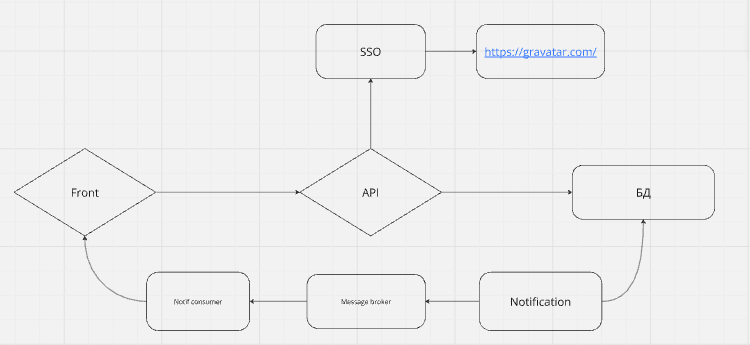
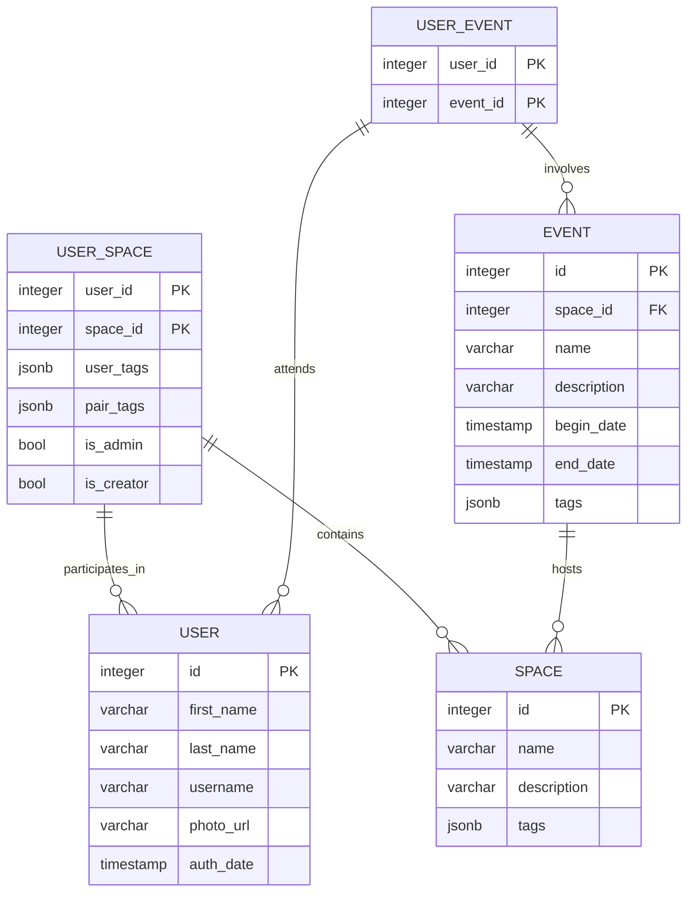

# Involvio

Телеграм бот для организации случайных встреч

## Содержание
- [Описание](#Описание)
- [Технологии](#технологии)
- [Начало работы](#начало-работы)
- [Тестирование](#тестирование)
- [Документация](#Документация)
- [Мониторинг](#Мониторинг-ресурсов)
- [Профайлинг](#Профайлер)
- [To do](#todo)
- [Команда проекта](#команда-проекта)

## Описание
После регистрации в телеграм-боте, бот будет предлагать каждую неделю встретиться с одним из людей, зарегистрированным в боте в пределах вашей группы. Человек для встречи выбирается случайным образом среди тех, с кем вы ещё не встречались. Каждую встречу можно оценить по 5ти бальной системе и написать заметку о человеке, с которым вы встречались. Заметка сохраняется и доступна только вам.
Если одного участника оценят подряд 3 раза на 1, то этому участнику будут остановлены встречи на год или до указания им команды /new

### Особенности бота:
В одном боте могут быть собраны различные люди с разными интересами, разделёнными кодом группы. Бот будет назначать встречи только между участниками одной группы, для этого при регистрации необходимо указать код группы.
Можно указать несколько групп через запятую. Если вы хотите встречаться с людьми из определенной группы и людьми, которые не указали группу укажите после кода своей основной группы запятую. В этом случае в статистике по команде /stat вы будете видеть статистику по группам.

### Наличие команд управления, позволяющих:
Приостановить назначение встреч на любое количество дней в случае отпуска или других временных причин.
Бот будет повторно назначать встречи через 6 месяцев, если вы не хотите повторно встречаться с конкретным участником, используйте команду /notmeet
Если три и более человека поставили "1" в качестве оценки встречи, то участник выключатся на год из участия в дальнейших встречах.
**Справочник команд:**
```
/help - Описание команд бота
/group - Изменить код группы в пределах которой ищутся участники для встречи
/stat - Статистика
/meet - Информация о прошедших встречах
/notmeet - Не встречаться больше с указанным участником
    /notmeet @НИК - Не встречаться больше с указанным пользователем
/stop - Приостановить встречи на неделю
    /stop NN - приостановить встречи на NN дней
/rating - Оценить последнюю встречу
    /rating @НИК - оценить встречу с указанным пользователем
/info - Что обо мне сохранено и как изменить
    /setCity - изменить свой город
    /setName - изменить свое имя
    /setUrl - изменить свою соц.сеть
```
### Создание приватной группы для встреч
Чтобы у вас была приватная группа, используйте уникальный код группы, например: Vip. Все ваши друзья должны при регистрации указывать код группы Vip, тогда бот будет организовывать встречи только между вашими участниками. Если Вы хотите организовывать встречи между разными группами, используйте в качестве разделителя запятую. Чтобы участвовать во встречах тех, кто не указал группу, то после списка групп поставьте запятую, например: Vip,777,. Для приглашения новых участников с указанием группы, используйте ссылку: https://t.me/Dirworld_bot?start=Vip. Рекомендую использовать уникальные, ассоциативные только для вашей группы коды, которые не станут использовать другие участники.

### Схема бота
[Miro](https://miro.com/welcomeonboard/U2I4Q0xiZ0hlUzNuR0dadHBvN0Z0UVNnbktPdVR5VnAwVFVya1k2dkFsbzNrUzh6OTNYNXRvZVBtZXAxR3NXQXwzMDc0NDU3MzQ5MTY0OTMxNDg4fDI=?share_link_id=406521025617)

## Технологии

1. GO 1.22.5
- [Huma](https://huma.rocks/)
- [Fiber](https://github.com/gofiber/fiber)
2. Postgres 14
- [pgx/v5](https://github.com/jackc/pgx)
- [squirrel](https://github.com/Masterminds/squirrel)
3. Docker

### Архитектура


### База данных


## Начало работы

### Предварительные требования
#### Необходимые компоненты
- [docker](https://docs.docker.com/engine/install/)
- [docker-compose](https://docs.docker.com/compose/install/)
- [migrate cli](https://pkg.go.dev/github.com/golang-migrate/migrate/v4#readme-cli-usage)
#### Переменные среды
- DB_PASSWORD - пароль для подклчения к postgres (по умолчанию - admin)
### Запуск
```shell
export DB_PASSWORD=admin ENV_NAME=dev && make dc
```

## Документация
[OpenAPI3.1](http://127.0.0.1:9000/docs)

## Мониторинг-ресурсов
- потребление cpu
- текущее потребление памяти процессом / ОС / общее количество памяти OC
- среднее время ответа на запрос
- количество открытых соединений

[МОНИТОР](http://127.0.0.1:9000/monitor)

## Профайлер
[PROFILER](http://127.0.0.1:9000/debug/pprof/)

## Тестирование

## TODO
- [ ] Добавить unit тесты
- [ ] Добавить integration тесты
- [ ] Добавить prometheus и grafana в docker-compose
- [ ] Нарисовать макеты и описать повторно юзкейзы 

## Команда проекта

