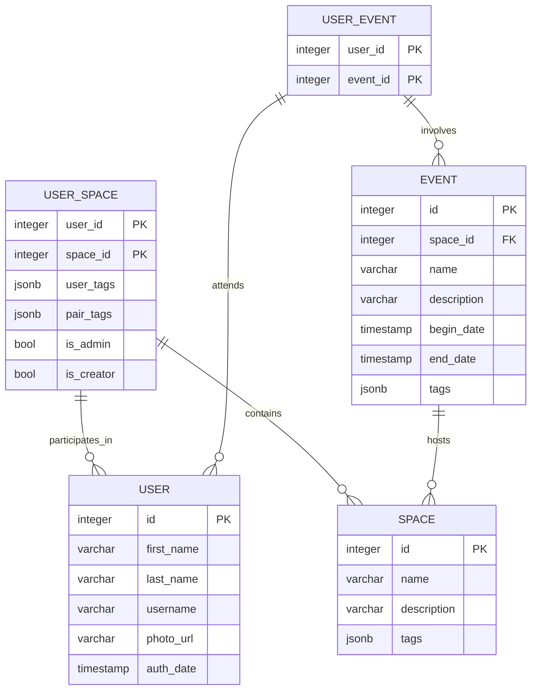

# Involvio

Платформа для организации random coffee внутри своего сообщества

## Содержание
- [Технологии](#технологии)
- [Начало работы](#начало-работы)
- [Тестирование](#тестирование)
- [Документация](#Документация)
- [Мониторинг](#Мониторинг-ресурсов)
- [Профайлинг](#Профайлер)
- [To do](#todo)
- [Команда проекта](#команда-проекта)


## Технологии

1. GO 1.22.5
- [Huma](https://huma.rocks/)
- [Fiber](https://github.com/gofiber/fiber)
2. Postgres 14
- [pgx/v5](https://github.com/jackc/pgx)
- [squirrel](https://github.com/Masterminds/squirrel)
3. Docker

### Архитектура


### База данных


## Начало работы

### Предварительные требования
#### Необходимые компоненты
- [docker](https://docs.docker.com/engine/install/)
- [docker-compose](https://docs.docker.com/compose/install/)
- [migrate cli](https://pkg.go.dev/github.com/golang-migrate/migrate/v4#readme-cli-usage)
#### Переменные среды
- DB_PASSWORD - пароль для подклчения к postgres (по умолчанию - admin)
### Запуск
```shell
export DB_PASSWORD=admin ENV_NAME=dev && make dc
```

## Документация
[OpenAPI3.1](http://127.0.0.1:9000/docs)

## Мониторинг-ресурсов
- потребление cpu
- текущее потребление памяти процессом / ОС / общее количество памяти OC
- среднее время ответа на запрос
- количество открытых соединений

[МОНИТОР](http://127.0.0.1:9000/monitor)

## Профайлер
[PROFILER](http://127.0.0.1:9000/debug/pprof/)

## Тестирование

## TODO
- [ ] Добавить unit тесты
- [ ] Добавить integration тесты
- [ ] Добавить prometheus и grafana в docker-compose
- [ ] Нарисовать макеты и описать повторно юзкейзы 

## Команда проекта

